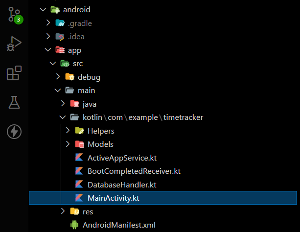

# App Usage tracker


From this project, you can learn how to build a Flutter mobile app that tracks app usage using real-time monitoring and customizable notifications. You can also learn how to use the MethodChannel to integrate platform-specific functionality into your app


<h1 style="border-bottom: none">About The Project</h1> 

App Usage Tracker is a Flutter mobile app that helps users track how much time they spend on their apps, using powerful notifications and block some of most used app. 

The Project is still under development and was inspired by popular apps such as Digital Wellbeing and ActionDash. But as they are being developed with native language so we  thought why not develop some functionality from them with Flutter.


<h1 style="border-bottom: none">Features Developed Till Now</h1>

1. ***Current Active App using foreground Service.***

2. ***The current active app in Foreground with duration used throught the day shown to user with help of notification .***

3. ***Starting foreground service when the device is restarted.***

<h1 style="border-bottom: none">How to get Tracking functionality in your project</h1>


Native apps have access to all the features of the platform, while Flutter apps may not have direct access to platform-level functionality. But we can achieve it by using a method channel  and writing a background service at native level

Follow the step and you can use our code to get the app tracking functionality in your project in no time.

**Step 1**

Create a Method channel at flutter end 

```dart
MethodChannel platform = MethodChannel(
    'your method channel name',
  );

 platform.invokeMethod("getForegroundPackage",
         {"dbPath": DataBaseHelper.instance.dataBasePath});

```

Here we have given a method name as getForegroundPackage which should be called when the  method is invoked from flutter end use invoke method in initstate method of your widget

**Step 2**

Once Method Channel is setup at flutter side jump to Main Activity in Android



Copy The following code in your MainActivity.kt

```Kotlin
var methodChannelName:String = "your method channel name";
    override fun configureFlutterEngine(@NonNull flutterEngine: FlutterEngine) {
        super.configureFlutterEngine(flutterEngine)
        MethodChannel(flutterEngine.dartExecutor.binaryMessenger, methodChannelName).setMethodCallHandler {
            call, result ->
            if(call.method == "getForegroundPackage") {

                val i = Intent(context, ActiveAppService::class.java)

                val isAlreadyRunning:Boolean = context.isMyServiceRunning(ActiveAppService::class.java)

                if (!isAlreadyRunning){
                    context.startService(i)
                    Log.e("Service Status","Started New Service")

                }
                else{
                    Log.e("Service Status","Already Running")
                }
            }
            
        }
    }

```


**Step 3**

Create a Foreground Service which will be running even when the app is closed you can refer to ***ActiveAppService.kt*** file in the project or you can use the following code to get which app is currently running in foreground

For more information on foreground services you can refer https://developer.android.com/guide/components/foreground-services

```Kotlin
   fun getActiveAppPackageName(context: Context): String {
        var pkgName: String? = null
        val usageStatsManager = context
                .getSystemService(USAGE_STATS_SERVICE) as UsageStatsManager
        val timeTnterval = (1000 * 600).toLong()
        val endTime = System.currentTimeMillis()
        val beginTime = endTime - timeTnterval
        val myUsageEvents: UsageEvents = usageStatsManager.queryEvents(beginTime, endTime)
        while (myUsageEvents.hasNextEvent()) {
            val myEvent: UsageEvents.Event = UsageEvents.Event()
            myUsageEvents.getNextEvent(myEvent)
            if (Build.VERSION.SDK_INT >= Build.VERSION_CODES.Q) {
                when (myEvent.eventType) {
                    UsageEvents.Event.ACTIVITY_RESUMED -> pkgName = myEvent.packageName
                    UsageEvents.Event.ACTIVITY_PAUSED -> if (myEvent.packageName.equals(pkgName)) {
                        pkgName = null
                    }
                }
            } else {
                when (myEvent.eventType) {
                    UsageEvents.Event.ACTIVITY_RESUMED -> pkgName = myEvent.packageName
                    UsageEvents.Event.ACTIVITY_RESUMED -> if (myEvent.packageName.equals(pkgName)) {
                        pkgName = null
                    }
                }
            }
        }
        if (pkgName == null){
            var currentApp = ""
            val usm = this.getSystemService(USAGE_STATS_SERVICE) as UsageStatsManager
            val time = System.currentTimeMillis()
            val appList =
                    usm.queryUsageStats(UsageStatsManager.INTERVAL_DAILY, time - 1000 * 1000, time)
            if (appList != null && appList.size > 0) {
                val mySortedMap: SortedMap<Long, UsageStats> = TreeMap()
                for (usageStats in appList) {
                    mySortedMap[usageStats.lastTimeUsed] = usageStats
                }
                if (mySortedMap != null && !mySortedMap.isEmpty()) {
                    currentApp = mySortedMap[mySortedMap.lastKey()]!!.packageName
                }
            }
            return currentApp
        }
        else{
            return  pkgName
        }

    }

```
<!-- **Step 4**

Once you have  -->


 


 